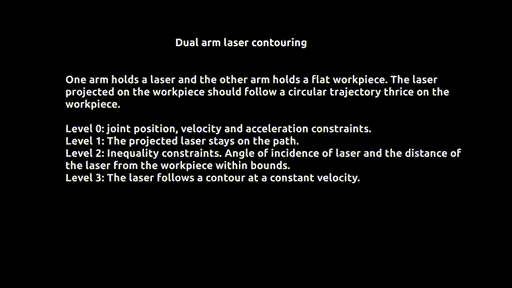

# Repository for weighted method for strictly hierarchical linear programming with applications to robot control

### Using L1 norm as a regularization step can allow for sparse or parsimonious control of the robot system.

This repository contains the source code for a paper submitted to IEEE RA-L/ICRA and is currently under review.
Documentation coming soon to improve readability of the code.

## Videos of experiments from the paper

### Dual arm control with WLP-L1 algorithm

### Dual arm control with WLP-L2 algorithm

### Dual arm laser contouring control


## Duality trick reformulation:

The source code for duality trick reformulation of the lexicographic linear program into a single objective linear program can be found in the duality trick folder. To run this file, MATLAB and Yalmip toolbox needs to be installed. To reproduce the computational performance reported in the paper, it is also recommended to install Gurobi which provides a free academic license.

There is also an undocumented implementation of the duality trick also for hierarchical quadratic programming.

https://yalmip.github.io/

https://www.gurobi.com/downloads/gurobi-optimizer-eula/

## Weighted and sequential methods 

The code is tested on Ubuntu 18.04LTS. The code for this part includes the following dependencies:

* **Python3.7** or higher

* **CasADi** - A toolbox used for automatic differentiation of the task functions and as the interface to optimization solvers.

* **PyBullet** - If one chooses to simulate and visualize the robot motion. 

We recommend to install the dependencies in a virtual environment by following the instructions below
```
python3 -m venv env_ral_check
source env_ral_check/bin/activate
pip3 install casadi
pip3 install pybullet
```
Please run dual_arm_task_coupled.py to run the example from Section V.D


The weighted and sequential problems with L1 norm penalty are implemented in Python using Casadi in the **hqp.py** file. Within this file:

* hqp.solve_cascadedQP4() - Is the implementation of the sequential method (warmstarted).
* hqp.solve_cascadedQP5() - Is the implementation of the sequential method (non-warmstarted). Stabler implementation but slow.
* solve_HQPl1() is the implementation of the weighted method.
* solve_adaptive_hqp3() is the implementation of the adaptive method.

### Run the examples requiring MOSEK

A free academic license for MOSEK can be requested at:
https://www.mosek.com/products/academic-licenses/

lexopt_mosek.py includes all the functions for the WLP-L1 task specification using MOSEK Fusion API. Please refer to dual_arm_coupled_mosek.py to learn how to use this file.

