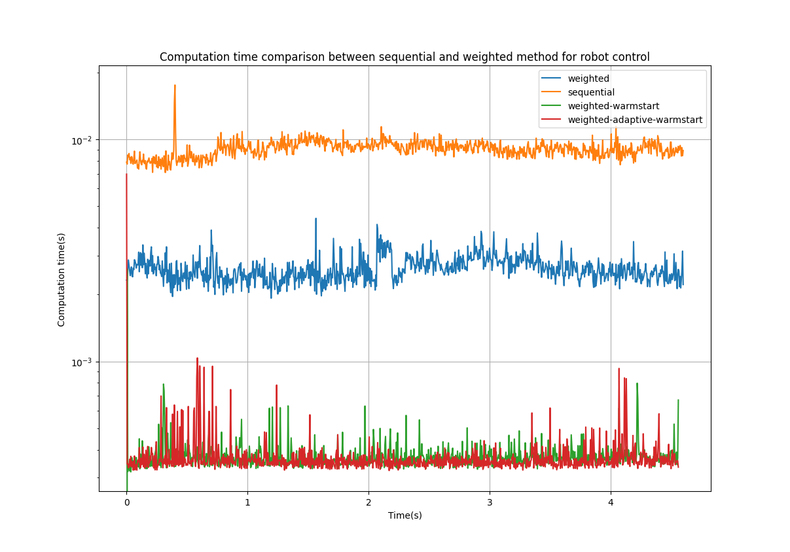

# Repository for weighted method for strictly hierarchical linear programming with applications to robot control

### Using L1 norm as a regularization step can allow for sparse or parsimonious control of the robot system.
### Specifying constraint violations using L1 norm leads to sparse constraint violations


This repository contains the source code for a paper submitted to IEEE RA-L/ICRA and is currently under review.
Documentation coming soon to improve readability of the code.

## Video of the experiment in paper (before revise and resubmit)


## Timing comparison of different methods for solving the hierarchical linear program



The weighted method is significantly faster than the sequential method as only one optimization problem is solved per iteration. But it does not provide any guarantees of lexicographic optimality if the correct weights are not chosen. Hence an adaptive method is devised which monitors the constraints that are violated. If there is a change in the violated constraints or a jump in these violations, a warm-started sequential method is implemented at that particular level to verify the lexicographic optimality. If found to be violated, weights are adapted.

The adaptive method was found to be computationally slighly more expensive but finds feasible weights automatically.

## Duality trick reformulation:

The source code for duality trick reformulation of the lexicographic linear program into a single objective linear program can be found in the duality trick folder. To run this file, MATLAB and Yalmip toolbox needs to be installed. To reproduce the computational performance reported in the paper, it is also recommended to install Gurobi which provides a free academic license.

There is also an undocumented implementation of the duality trick also for hierarchical quadratic programming.

https://yalmip.github.io/

https://www.gurobi.com/downloads/gurobi-optimizer-eula/

## Weighted and sequential methods 

The code for this part includes the following dependencies:

* **Python3.5** or above

* **CasADi** - A toolbox used for automatic differentiation of the task functions and as the interface to optimization solvers. Can be installed by
```
pip3 install casadi
```
* **PyBullet** - If one chooses to simulate and visualize the robot motion. Can be installed by:

```
pip3 install pybullet
```


The weighted and sequential problems with L1 norm penalty are implemented in Python using Casadi in the **hqp.py** file. Within this file:

* hqp.solve_cascadedQP4() - Is the implementation of the sequential method.
* solve_HQPl1() is the implementation of the weighted method.
* solve_adaptive_hqp3() is a newly implemented adaptive method whose verification of lexicographic optimality is exact because simply the corresponding sequential method is used for verification.


